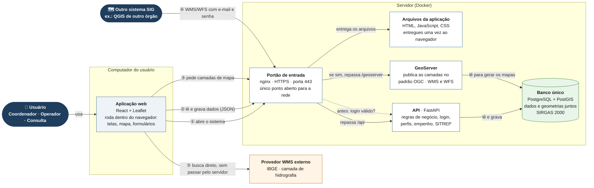

# Arquitetura

## Visão geral

**Como ler o diagrama:**

| Fluxo | O que acontece |
|---|---|
| ① abrir o sistema | o navegador baixa a aplicação web (HTML, JavaScript, CSS); a partir daí as telas e o mapa **rodam no navegador** |
| ② usar o sistema | cada ação (cadastrar recurso, abrir ocorrência, empenhar) vira uma chamada à **API**, que aplica as regras e grava no banco |
| ③ camadas OGC no mapa | o portão de entrada **primeiro pergunta à API se o login é válido**; só então repassa o pedido ao GeoServer |
| ④ outros sistemas SIG | o QGIS de outro órgão consome as mesmas camadas em WMS/WFS, autenticando com e-mail e senha de um usuário ativo (RF-11) |
| ⑤ camada externa | o navegador busca a camada do IBGE **direto no provedor**; se o IBGE cair, só essa camada some e o resto continua funcionando (RF-15) |

Pontos-chave: **um único ponto de entrada** com HTTPS (RNF-06) e **um único
banco**, usado pela API e pelo GeoServer (RNF-01: arquitetura dual vedada).

## Por que este arranjo

- **Um SGBD só, não dois.** RNF-01 veda "arquitetura dual" (um banco de
  negócio + um banco espacial separado). API e GeoServer apontam para o
  *mesmo* PostgreSQL/PostGIS; a geometria de `recursos` e `ocorrencias` mora
  nas mesmas tabelas que seus atributos, com índice GiST.
- **GeoServer em vez de WMS/WFS caseiro.** Implementar `GetCapabilities`,
  `GetMap`, `GetLegendGraphic`, `DescribeFeatureType` e `GetFeature` (RF-11)
  na mão é reinventar um servidor de mapas — GeoServer faz isso
  corretamente, é software livre e é o que a própria IDE-Defesa/INDE usa na
  prática (RNF-09).
- **Duas representações de `recursos`, um propósito cada.** O mapa
  operacional consome GeoJSON direto da API (`/api/recursos/geojson`), com
  polling de 20s para refletir mudanças entre sessões (RF-10) e clique para
  ver atributos (RF-08). O WMS do GeoServer existe para interoperabilidade
  (RF-11) — outro sistema (ex.: um cliente QGIS) consome a mesma informação
  em formato OGC padrão, sem precisar conhecer a API do SISCOORD-DC.
- **Auditoria não editável pela aplicação, de verdade.** RF-13 pede uma
  trilha "consultável e não editável pela aplicação". Isso é garantido no
  nível de permissão do banco: o papel de conexão da API (`siscoord_app`) não
  tem `GRANT` de `INSERT/UPDATE/DELETE` na tabela `auditoria` — só um
  trigger `SECURITY DEFINER`, disparado automaticamente a cada escrita nas
  tabelas de negócio, consegue gravar ali. Ver [modelo-dados.md](modelo-dados.md).
- **TLS na borda, e só na borda.** RNF-06 exige HTTPS; o nginx termina TLS e
  reparte para frontend, API e GeoServer — nenhum desses três precisa saber
  de certificado. Por isso as portas diretas da API (8000) e do GeoServer
  (8080) são publicadas só em `127.0.0.1` no host: servem para diagnóstico e
  administração local, mas nenhum tráfego vindo da rede chega a elas sem
  passar pelo HTTPS. A documentação Swagger fica em `/api/docs`, atrás do
  mesmo proxy.
- **WMS/WFS também exigem login.** O GeoServer não conhece os usuários do
  sistema, então o nginx pergunta à API antes de repassar cada requisição a
  `/geoserver/*` (`auth_request` → `GET /api/auth/verificar-ogc`). A API aceita
  três credenciais: o cookie `HttpOnly` gravado no login (os tiles do mapa são
  `` e não mandam cabeçalho), HTTP Basic com e-mail e senha (QGIS e outros
  clientes SIG, RF-11) e `Bearer` (scripts). Qualquer perfil lê as camadas; o
  que se exige é usuário autenticado e ativo — regra de acesso da IDE-Defesa
  (RNF-09). Ver [`backend/app/auth/acesso_ogc.py`](../backend/app/auth/acesso_ogc.py).
- **RF-15 não derruba o sistema se o provedor cair.** A camada WMS externa é
  só mais um `TileLayer` no Leaflet: se o provedor está fora do ar, os tiles
  daquela camada simplesmente não carregam — o resto do mapa (recursos,
  ocorrências, camadas próprias) continua funcionando normalmente.

## Fluxo de escrita crítico (empenho de recurso)

A prevenção de duplo empenho (OBJ-3) não depende só da API verificar
`estado == 'disponivel'` antes de empenhar — isso sozinho tem uma janela de
corrida entre duas requisições simultâneas. A garantia real é um **índice
único parcial** no Postgres (`uq_empenho_ativo_por_recurso`, sobre
`empenhos(recurso_id) WHERE status = 'ativo'`): mesmo que dois operadores
cliquem "empenhar" no mesmo recurso ao mesmo tempo, só um `INSERT` vence — o
outro recebe uma violação de constraint, que a API traduz para uma mensagem
em português (RNF-05). Ver o diagrama de sequência em
[uml/sequencia-empenho.md](uml/sequencia-empenho.md).

## Papéis de banco

| Papel | Uso | Permissões |
|---|---|---|
| `siscoord` (ou o `POSTGRES_USER` configurado) | roda as migrações (Alembic) | dono do schema, todas as permissões |
| `siscoord_app` | usado pela API e pelo GeoServer em tempo de execução | CRUD nas tabelas de negócio; **somente leitura** em `auditoria` |

## RBAC (RF-12)

| Perfil | Pode |
|---|---|
| **Coordenador** | tudo: cadastro mestre de recursos, gestão de usuários, camadas WMS externas, todas as operações de Operador, auditoria |
| **Operador** | registrar ocorrências e demandas, empenhar/liberar recursos, mudar estado operacional de um recurso (ex.: indisponível) — não cadastra/edita/inativa recursos nem gerencia usuários |
| **Consulta** | somente leitura em tudo; a UI oculta as ações que o perfil não pode executar |

A checagem acontece nas duas pontas: o backend rejeita com `403` qualquer
chamada fora do perfil (é a garantia real), e o frontend simplesmente não
renderiza os botões correspondentes (para não sinalizar falsamente que a
ação é possível).
