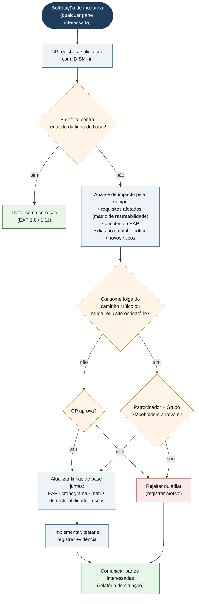

# Controle integrado de mudanças

A linha de base de escopo é o **Documento de Requisitos v2.0 (03/08/2026)**,
decomposto na [EAP](eap.md). Qualquer alteração em requisito, escopo, prazo ou
critério de aceite passa por este fluxo antes de virar código.

**O que não passa por aqui:** correção de defeito que faz o sistema cumprir um
requisito que *já* estava na linha de base (por exemplo, os riscos R07, R09 e
R14 em [riscos.md](riscos.md)). Isso é trabalho da EAP 1.8/1.11 e segue direto
para correção, só com registro no relatório de situação.

## Fluxo



## Alçadas de aprovação

| Tipo de mudança | Quem aprova |
|---|---|
| Ajuste interno sem efeito em requisito, prazo ou caminho crítico (ex.: reordenar atividades com folga) | Gerente de Projeto |
| Mudança em requisito **desejável**, ou que consome folga de atividade fora do caminho crítico | Gerente de Projeto, informando os Stakeholders |
| Mudança em requisito **obrigatório**, na data de entrega, ou que consome o caminho crítico | Stakeholders (julgamento nas sprints de 15/09 e 22/09) |

**Congelamento de escopo:** a partir da **sprint parcial 1 (15/09/2026)** (fim do
desenvolvimento), só entram mudanças que corrijam defeito ou que o
patrocinador classifique como impeditivas para a decisão.

## Formulário de solicitação de mudança

Copie o bloco abaixo para uma *issue* no repositório ou para o registro de
mudanças.

```text
ID: SM-__
Data:                         Solicitante:
Tipo: [ ] requisito  [ ] escopo  [ ] prazo  [ ] critério de aceite
Descrição da mudança:
Justificativa:

--- Análise de impacto (equipe) ---
Requisitos afetados (RF/RNF):
Pacotes da EAP afetados:
Esforço estimado (dias úteis):
Efeito no caminho crítico:   [ ] nenhum  [ ] consome folga  [ ] atrasa entrega
Novos riscos:

--- Decisão ---
[ ] aprovada  [ ] rejeitada  [ ] adiada      Por:            Data:
Motivo:
Documentos atualizados: [ ] EAP [ ] cronograma [ ] matriz de rastreabilidade [ ] riscos
```

## Registro de mudanças

| ID | Data | Solicitante | Descrição | Impacto | Decisão | Data da decisão |
|---|---|---|---|---|---|---|
| — | — | — | nenhuma mudança de escopo aprovada nas sprints; as correções de 15 a 18/09 foram defeitos contra a linha de base | — | — | — |
