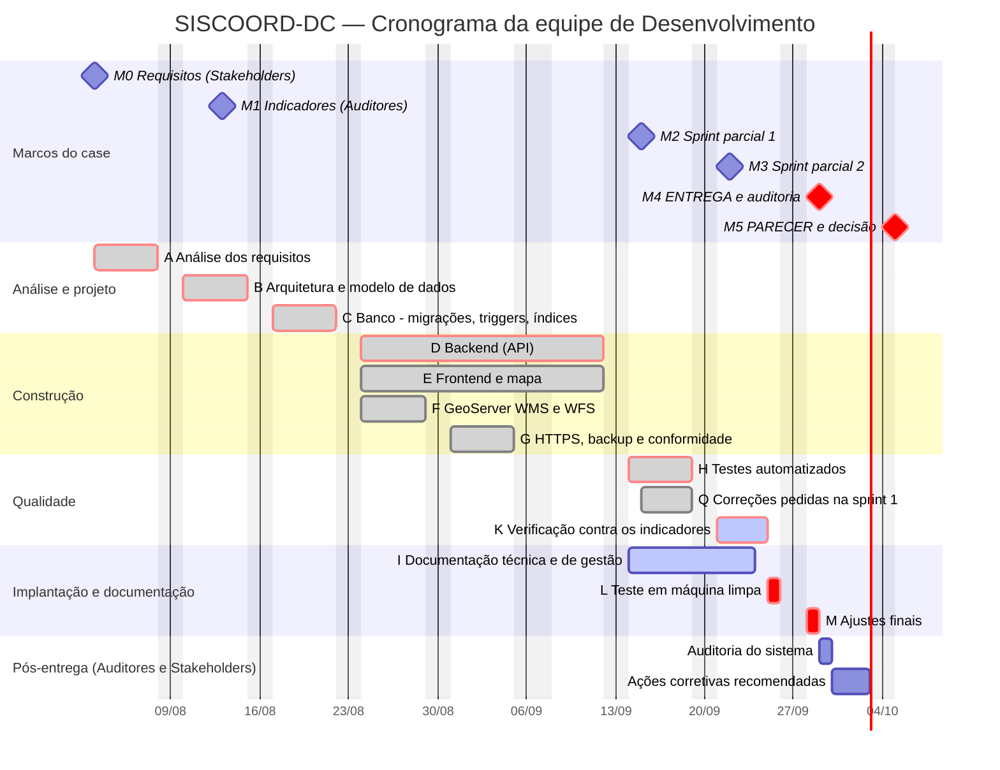
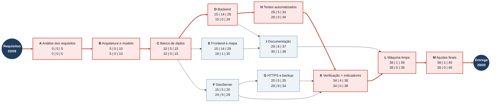

# Cronograma

Cronograma da **equipe de Desenvolvimento** (9 integrantes), montado sobre o
calendário do case:

| Data | Quem | O que acontece |
|---|---|---|
| 03/08/2026 | Stakeholders | definem os requisitos (linha de base: Documento de Requisitos v2.0) |
| 13/08/2026 | Auditores | definem os indicadores para avaliar o cumprimento dos requisitos |
| 15/09/2026 | Desenvolvedores · Stakeholders | **sprint parcial 1**: equipe apresenta o andamento; Stakeholders julgam solicitações de mudança |
| 22/09/2026 | Desenvolvedores · Stakeholders | **sprint parcial 2**: idem |
| 29/09/2026 | Desenvolvedores · Auditores | **entrega** do sistema; Auditores auditam com base nos indicadores de 13/08 |
| 05/10/2026 | Auditores · Stakeholders | parecer de conformidade e **aprovação ou reprovação** da entrega |

**Dias úteis entre a linha de base e a entrega:** 40 (segunda a sexta, sem o
feriado de 07/09).

## Marcos

| Marco | Data | Critério |
|---|---|---|
| M0 — Requisitos definidos | seg 03/08/2026 | Documento de Requisitos v2.0 recebido dos Stakeholders |
| M1 — Indicadores de auditoria | qui 13/08/2026 | framework de avaliação dos Auditores recebido; roteiro de verificação da matriz de rastreabilidade alinhado a ele |
| M2 — Sprint parcial 1 | ter 15/09/2026 | backend, frontend, banco e GeoServer funcionando; mudanças julgadas pelos Stakeholders |
| M3 — Sprint parcial 2 | ter 22/09/2026 | correções da sprint 1 aplicadas; testes e documentação apresentados |
| **M4 — Entrega e auditoria** | **ter 29/09/2026** | sistema, documentação e evidências entregues aos Auditores |
| **M5 — Parecer e decisão** | **seg 05/10/2026** | parecer de conformidade dos Auditores; aprovação ou reprovação pelos Stakeholders |

## Diagrama de Gantt

Barras em vermelho estão no **caminho crítico**: qualquer atraso nelas atrasa
a entrega.

## Tabela de atividades

Durações em **dias úteis**. `IC`/`TC` = início e término mais cedo; `IT`/`TT` =
início e término mais tarde (contados a partir de 03/08 = dia 0). Folga
= `IT − IC`.

| ID | Atividade | EAP | Dur. | Predecessoras | Início | Término | IC | TC | IT | TT | Folga |
|---|---|---|---|---|---|---|---|---|---|---|---|
| A | Análise dos requisitos | 1.2 | 5 | — | 03/08 | 07/08 | 0 | 5 | 0 | 5 | **0** |
| B | Arquitetura e modelo de dados | 1.3.1, 1.3.2 | 5 | A | 10/08 | 14/08 | 5 | 10 | 5 | 10 | **0** |
| C | Banco: migrações, triggers e índices | 1.3.3, 1.3.4 | 5 | B | 17/08 | 21/08 | 10 | 15 | 10 | 15 | **0** |
| D | Backend (API) | 1.4 | 14 | C | 24/08 | 11/09 | 15 | 29 | 15 | 29 | **0** |
| E | Frontend e mapa | 1.5, 1.6.2 | 14 | C | 24/08 | 11/09 | 15 | 29 | 16 | 30 | 1 |
| F | GeoServer WMS e WFS | 1.6.1 | 5 | C | 24/08 | 28/08 | 15 | 20 | 24 | 29 | 9 |
| G | HTTPS, backup e conformidade | 1.7 | 5 | F | 31/08 | 04/09 | 20 | 25 | 29 | 34 | 9 |
| H | Testes automatizados | 1.8.1 | 5 | D | 14/09 | 18/09 | 29 | 34 | 29 | 34 | **0** |
| I | Documentação técnica e de gestão | 1.10, 1.1 | 8 | D, E | 14/09 | 23/09 | 29 | 37 | 30 | 38 | 1 |
| K | Verificação contra os indicadores dos Auditores | 1.8.2, 1.8.3, 1.11.1 | 4 | F, G, H | 21/09 | 24/09 | 34 | 38 | 34 | 38 | **0** |
| L | Teste de instalação em máquina limpa | 1.9.3 | 1 | K, I | 25/09 | 25/09 | 38 | 39 | 38 | 39 | **0** |
| M | Ajustes finais | 1.11.2 | 1 | L | 28/09 | 28/09 | 39 | 40 | 39 | 40 | **0** |
| — | **Entrega (M4)** | 1.11.2 | 0 | M | 29/09 | 29/09 | 40 | 40 | 40 | 40 | **0** |

A atividade **Q — Correções pedidas na sprint 1** (15 a 18/09) não entra no
cálculo porque não estava planejada: nasceu do retorno da sprint parcial 1 e
foi absorvida em paralelo à atividade H.

**Caminho crítico:** A → B → C → D → H → K → L → M → Entrega = 5 + 5 + 5 + 14
+ 5 + 4 + 1 + 1 = **40 dias úteis**, exatamente a janela entre os requisitos e
a entrega.

## Diagrama de rede (método do caminho crítico)

Cada caixa mostra `IC | duração | TC` em cima e `IT | folga | TT` embaixo.
Setas e caixas em vermelho formam o caminho crítico.

## Leitura do cronograma

- **O caminho crítico ocupa os 40 dias úteis.** Não há folga entre a linha
  de base e a entrega; por isso as correções pedidas na sprint 1 (Q) foram
  feitas em paralelo aos testes, sem empurrar a verificação (K).
- **Os indicadores dos Auditores (13/08) chegaram durante o projeto (B).**
  O roteiro de verificação da matriz de rastreabilidade foi alinhado a eles,
  e a atividade K é justamente conferir cada requisito contra esses
  indicadores antes da entrega.
- **As sprints parciais são pontos de controle, não de entrega.** Em 15/09 e
  22/09 a equipe apresenta o andamento e os Stakeholders julgam mudanças
  ([controle de mudanças](controle-mudancas.md)); o que eles aprovarem entra
  pela atividade Q ou M.
- **Depois de 29/09 o trabalho é dos Auditores e dos Stakeholders.** A equipe
  fica disponível de 30/09 a 02/10 para executar as ações corretivas que os
  Auditores recomendarem no prazo disponível, antes do parecer de 05/10.
