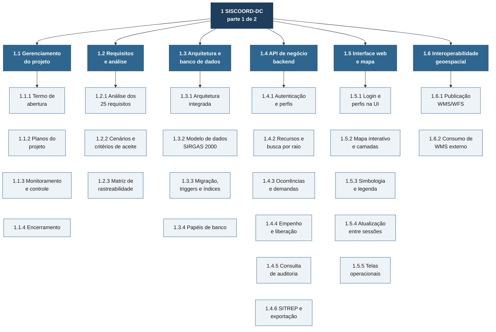
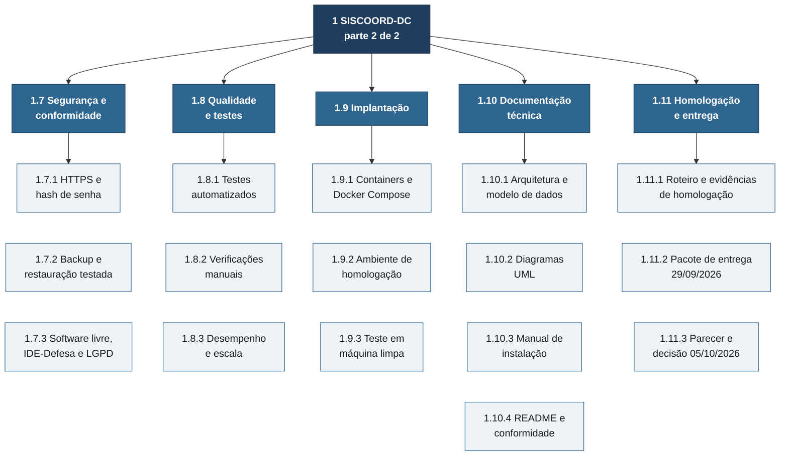

# EAP — Estrutura Analítica do Projeto

A EAP é **orientada a entregas**: cada ramo é um resultado verificável, não
uma fase. O 3º nível são os **pacotes de trabalho**, cada um com responsável e
critério de aceite no [dicionário](#dicionário-da-eap).

Soma do escopo: os pacotes abaixo cobrem os 25 requisitos do Documento de
Requisitos v2.0 **e** o trabalho que não é requisito, mas sem o qual não há
entrega (gestão, homologação, pacote de entrega). Trabalho fora desta EAP está
fora do escopo ([termo de abertura, 3.2](termo-abertura.md#32-fora-do-escopo)).

## Diagrama da EAP

**Nível 1:** o projeto. **Nível 2:** 11 entregáveis (azul). **Nível 3:** 40
pacotes de trabalho (claros).

### EAP completa — parte 1 de 2 (1.1 a 1.6)

Os pacotes de trabalho ficam empilhados sob o entregável a que pertencem. A
EAP foi dividida em duas partes para continuar legível na tela e na
impressão.



### EAP completa — parte 2 de 2 (1.7 a 1.11)



### EAP em lista (para copiar para outras ferramentas)

```text
1 SISCOORD-DC
├── 1.1 Gerenciamento do projeto
│   ├── 1.1.1 Termo de abertura
│   ├── 1.1.2 Planos do projeto
│   ├── 1.1.3 Monitoramento e controle
│   └── 1.1.4 Encerramento
├── 1.2 Requisitos e análise
│   ├── 1.2.1 Análise dos 25 requisitos
│   ├── 1.2.2 Cenários CEN-1/2/3 e critérios de aceite
│   └── 1.2.3 Matriz de rastreabilidade
├── 1.3 Arquitetura e banco de dados
│   ├── 1.3.1 Arquitetura integrada (RNF-01)
│   ├── 1.3.2 Modelo de dados PostGIS / SIRGAS 2000 (RNF-02)
│   ├── 1.3.3 Migração, triggers e índices (RF-02, RF-13, RNF-04)
│   └── 1.3.4 Papéis e permissões de banco
├── 1.4 API de negócio (backend)
│   ├── 1.4.1 Autenticação e perfis (RF-12)
│   ├── 1.4.2 Recursos e busca por raio (RF-01, RF-02, RF-07)
│   ├── 1.4.3 Ocorrências e demandas (RF-03, RF-04)
│   ├── 1.4.4 Empenho, liberação e compatíveis (RF-05, RF-06)
│   ├── 1.4.5 Consulta de auditoria (RF-13)
│   └── 1.4.6 SITREP e exportação (RF-14, RNF-03)
├── 1.5 Interface web e mapa (frontend)
│   ├── 1.5.1 Login, layout e ocultação por perfil
│   ├── 1.5.2 Mapa interativo e camadas (RF-08)
│   ├── 1.5.3 Simbologia e legenda (RF-09)
│   ├── 1.5.4 Atualização entre sessões (RF-10)
│   └── 1.5.5 Telas de recursos, ocorrências, usuários e auditoria
├── 1.6 Interoperabilidade geoespacial
│   ├── 1.6.1 Publicação WMS/WFS no GeoServer (RF-11)
│   └── 1.6.2 Consumo de WMS externo (RF-15)
├── 1.7 Segurança e conformidade
│   ├── 1.7.1 HTTPS e hash de senha (RNF-06)
│   ├── 1.7.2 Backup e restauração testada (RNF-06)
│   └── 1.7.3 Software livre, IDE-Defesa e LGPD (RNF-09)
├── 1.8 Qualidade e testes
│   ├── 1.8.1 Testes automatizados
│   ├── 1.8.2 Verificações manuais (RF-08 a RF-11, RF-15, RNF-05)
│   └── 1.8.3 Desempenho e escala (RNF-04, RNF-10)
├── 1.9 Implantação
│   ├── 1.9.1 Containers e Docker Compose
│   ├── 1.9.2 Ambiente de homologação
│   └── 1.9.3 Teste em máquina limpa (RNF-07)
├── 1.10 Documentação técnica (RNF-08)
│   ├── 1.10.1 Arquitetura e modelo de dados
│   ├── 1.10.2 Diagramas UML
│   ├── 1.10.3 Manual de instalação
│   └── 1.10.4 README e conformidade
└── 1.11 Homologação e entrega
    ├── 1.11.1 Roteiro e evidências de homologação
    ├── 1.11.2 Pacote de entrega (29/09/2026)
    └── 1.11.3 Parecer dos Auditores e decisão (05/10/2026)
```

## Dicionário da EAP

**Legenda da situação (21/09/2026, após a sprint parcial 1):**
✅ entregável produzido e presente no repositório ·
🟡 produzido, mas falta evidência de verificação ·
🔵 em andamento ·
⏳ não iniciado ou sem evidência registrada.

"Produzido" não é "aceito": o aceite formal de cada requisito acontece no
pacote 1.11.1, contra o ambiente de homologação.

Siglas dos responsáveis (detalhe em [organizacao-raci.md](organizacao-raci.md)):
**GP** Gerente de Projeto · **BE** Desenvolvedor Backend · **FE** Desenvolvedor
Frontend/SIG · **INF** Infraestrutura · **QA** Qualidade · **DOC** Documentação.

### 1.1 Gerenciamento do projeto

| Código | Pacote de trabalho | Entregável e critério de aceite | Req. | Resp. | Situação |
|---|---|---|---|---|---|
| 1.1.1 | Termo de abertura | [termo-abertura.md](termo-abertura.md) assinado pelo patrocinador | — | GP | 🔵 elaborado, aguarda assinatura |
| 1.1.2 | Planos do projeto | EAP, [cronograma](cronograma.md), [riscos](riscos.md), [comunicação](partes-interessadas.md), [RACI](organizacao-raci.md) publicados em `docs/gestao/` | — | GP | ✅ |
| 1.1.3 | Monitoramento e controle | [relatório de situação](status-projeto.md) atualizado toda semana; mudanças registradas conforme o [controle de mudanças](controle-mudancas.md) | — | GP | 🔵 contínuo |
| 1.1.4 | Encerramento | termo de aceite assinado; lições aprendidas registradas | — | GP | ⏳ após 05/10 |

### 1.2 Requisitos e análise

| Código | Pacote de trabalho | Entregável e critério de aceite | Req. | Resp. | Situação |
|---|---|---|---|---|---|
| 1.2.1 | Análise dos requisitos | cada um dos 25 requisitos tem entendimento e componente definidos | todos | GP, BE | ✅ |
| 1.2.2 | Cenários e critérios de aceite | roteiro passo a passo de CEN-1, CEN-2 e CEN-3 com resultado esperado | todos | GP, QA | 🟡 CEN-1 detalhado em [casos-de-uso.md](../uml/casos-de-uso.md); CEN-2 e CEN-3 sem roteiro formal |
| 1.2.3 | Matriz de rastreabilidade | [matriz-rastreabilidade.md](../matriz-rastreabilidade.md) com componente e verificação para os 25 requisitos | RNF-08 | DOC | ✅ |

### 1.3 Arquitetura e banco de dados

| Código | Pacote de trabalho | Entregável e critério de aceite | Req. | Resp. | Situação |
|---|---|---|---|---|---|
| 1.3.1 | Arquitetura integrada | API e GeoServer usam o **mesmo** PostgreSQL/PostGIS; não há segunda cópia da geometria | RNF-01 | BE, INF | ✅ |
| 1.3.2 | Modelo de dados | todas as colunas de geometria em `geometry(..., 4674)`; ER em [modelo-dados.md](../modelo-dados.md) | RNF-02 | BE | ✅ |
| 1.3.3 | Migração, triggers e índices | migração `0001` com trigger de transição de estado, trigger de auditoria, índice único de empenho ativo e índices GiST; migração `0002` estende a auditoria a `camadas_externas` (Q4) | RF-02, RF-13, RNF-04, OBJ-3 | BE | ✅ |
| 1.3.4 | Papéis de banco | papel `siscoord_app` com CRUD nas tabelas de negócio e **só leitura** em `auditoria` | RF-13, RNF-06 | BE, INF | ✅ |

### 1.4 API de negócio (backend)

| Código | Pacote de trabalho | Entregável e critério de aceite | Req. | Resp. | Situação |
|---|---|---|---|---|---|
| 1.4.1 | Autenticação e perfis | login JWT; endpoints respondem `403` fora do perfil; `tests/test_rbac.py` passa | RF-12 | BE | ✅ |
| 1.4.2 | Recursos e busca | cadastro, alteração, inativação e mudança de estado; busca por raio e atributos; `tests/test_recursos.py` passa | RF-01, RF-02, RF-07 | BE | ✅ |
| 1.4.3 | Ocorrências e demandas | ocorrência com tipo, severidade, IBGE e polígono; saldo descoberto calculado; `tests/test_ocorrencias.py` passa | RF-03, RF-04 | BE | ✅ |
| 1.4.4 | Empenho e liberação | empenho e liberação registram autor e data-hora; duplo empenho recusado pelo banco; compatíveis ordenados por distância; `tests/test_empenhos.py` passa | RF-05, RF-06, OBJ-3 | BE | ✅ |
| 1.4.5 | Consulta de auditoria | `GET /api/auditoria` com filtros; nenhuma rota de escrita; `tests/test_auditoria.py` passa | RF-13 | BE | ✅ |
| 1.4.6 | SITREP e exportação | PDF por ocorrência; exportação GeoJSON (com `crs`) e GeoPackage; `tests/test_relatorios.py` passa | RF-14, RNF-02, RNF-03 | BE | ✅ |

### 1.5 Interface web e mapa (frontend)

| Código | Pacote de trabalho | Entregável e critério de aceite | Req. | Resp. | Situação |
|---|---|---|---|---|---|
| 1.5.1 | Login, layout e perfis | telas e botões que o perfil não pode usar não aparecem | RF-12, RNF-05 | FE | ✅ |
| 1.5.2 | Mapa interativo | camadas ligáveis uma a uma; popup com atributos ao clicar; desenho de polígono; busca por raio | RF-03, RF-07, RF-08 | FE | ✅ |
| 1.5.3 | Simbologia e legenda | forma indica tipo e cor indica estado; legenda coerente com o mapa | RF-09 | FE | ✅ |
| 1.5.4 | Atualização entre sessões | consultas operacionais recarregam a cada 20 s, sem F5 | RF-10 | FE | ✅ |
| 1.5.5 | Telas operacionais | recursos, ocorrências (lista e detalhe com empenho), usuários e auditoria | RF-01, RF-04, RF-05, RF-06, RF-13, RF-14 | FE | ✅ |

### 1.6 Interoperabilidade geoespacial

| Código | Pacote de trabalho | Entregável e critério de aceite | Req. | Resp. | Situação |
|---|---|---|---|---|---|
| 1.6.1 | Publicação WMS/WFS | `GetCapabilities` de WMS 1.3.0 e WFS 2.0.0 lista `siscoord:recursos` e `siscoord:ocorrencias` em EPSG:4674; acesso só com login (Q2) | RF-11, RNF-03 | INF | ✅ |
| 1.6.2 | Consumo de WMS externo | camada externa aparece no mapa; com provedor fora do ar, o resto do mapa funciona e o painel mostra "indisponível" | RF-15 | FE | 🟡 tela "Camadas externas" e camada de exemplo (Hidrografia IBGE) adicionadas em 15/09 (Q3); falta evidência em homologação |

### 1.7 Segurança e conformidade

| Código | Pacote de trabalho | Entregável e critério de aceite | Req. | Resp. | Situação |
|---|---|---|---|---|---|
| 1.7.1 | HTTPS e hash de senha | nginx com TLS e redirecionamento 80→443; senhas em bcrypt | RNF-06 | INF, BE | 🟡 portas 8000/8080 restritas ao loopback em 15/09 (Q1); falta evidência em homologação |
| 1.7.2 | Backup e restauração | `scripts/testar_backup_restore.sh` executado com sucesso e resultado registrado | RNF-06 | INF | 🟡 scripts prontos; falta registro da execução |
| 1.7.3 | Conformidade | `LICENSE` (MIT); [conformidade.md](../conformidade.md) cobrindo software livre, IDE-Defesa e LGPD | RNF-09 | DOC | 🟡 acesso às camadas OGC com login implementado em 15/09 (Q2); falta revisão jurídica recomendada no próprio documento |

### 1.8 Qualidade e testes

| Código | Pacote de trabalho | Entregável e critério de aceite | Req. | Resp. | Situação |
|---|---|---|---|---|---|
| 1.8.1 | Testes automatizados | `pytest -v` passa no ambiente de homologação; saída anexada às evidências | 14 requisitos (ver [status](status-projeto.md#cobertura-de-verificação)) | BE, QA | ✅ 36 testes passando em 21/09 (ambiente Docker), incluindo os 2 arquivos novos da sprint 1 |
| 1.8.2 | Verificações manuais | roteiro executado com print ou vídeo para RF-08, RF-09, RF-10, RF-11, RF-15 e RNF-05 (contagem de ≤ 5 interações no CEN-1) | RF-08 a RF-11, RF-15, RNF-05 | QA | ⏳ sem evidência registrada |
| 1.8.3 | Desempenho e escala | mapa inicial ≤ 5 s com 6 camadas; busca por raio ≤ 3 s com 1.000 recursos; 20 usuários simultâneos com 500 recursos e 20 ocorrências | RNF-04, RNF-10 | QA, INF | ⏳ massa de dados pronta (`seed_escala.py`); falta medição e script de carga |

### 1.9 Implantação

| Código | Pacote de trabalho | Entregável e critério de aceite | Req. | Resp. | Situação |
|---|---|---|---|---|---|
| 1.9.1 | Containers | `docker compose up -d --build` sobe os 6 serviços; `geoserver-init` termina com código 0 | RNF-07 | INF | ✅ |
| 1.9.2 | Ambiente de homologação | máquina dedicada com o sistema no ar, acessível aos Auditores | definição de pronto | INF | ⏳ a confirmar |
| 1.9.3 | Teste em máquina limpa | pessoa de fora da equipe sobe o sistema só com o [manual](../manual-instalacao.md), cronometrado, em ≤ 60 min | RNF-07 | QA | ⏳ |

### 1.10 Documentação técnica

| Código | Pacote de trabalho | Entregável e critério de aceite | Req. | Resp. | Situação |
|---|---|---|---|---|---|
| 1.10.1 | Arquitetura e modelo de dados | [arquitetura.md](../arquitetura.md), [modelo-dados.md](../modelo-dados.md) | RNF-08 | DOC, BE | ✅ |
| 1.10.2 | Diagramas UML | [casos de uso](../uml/casos-de-uso.md), [classes](../uml/classes.md), [sequência](../uml/sequencia-empenho.md), [implantação](../uml/implantacao.md) | RNF-08 | DOC | ✅ |
| 1.10.3 | Manual de instalação | [manual-instalacao.md](../manual-instalacao.md) validado pelo pacote 1.9.3 | RNF-07, RNF-08 | DOC, INF | ✅ (validação em 1.9.3) |
| 1.10.4 | README e conformidade | [README.md](../../README.md), [conformidade.md](../conformidade.md) | RNF-08, RNF-09 | DOC | ✅ |

### 1.11 Homologação e entrega

| Código | Pacote de trabalho | Entregável e critério de aceite | Req. | Resp. | Situação |
|---|---|---|---|---|---|
| 1.11.1 | Roteiro e evidências | para cada um dos 25 requisitos: resultado (atende / não atende), evidência e data, no ambiente de homologação | definição de pronto | QA, GP | ⏳ |
| 1.11.2 | Pacote de entrega | repositório versionado (tag de release), documentação e evidências entregues até 29/09/2026 | todos | GP | ⏳ |
| 1.11.3 | Parecer e decisão | auditoria em 29/09 com base nos indicadores de 13/08; ações corretivas recomendadas executadas até 02/10; parecer dos Auditores e decisão dos Stakeholders em 05/10/2026 | todos | GP | ⏳ |
