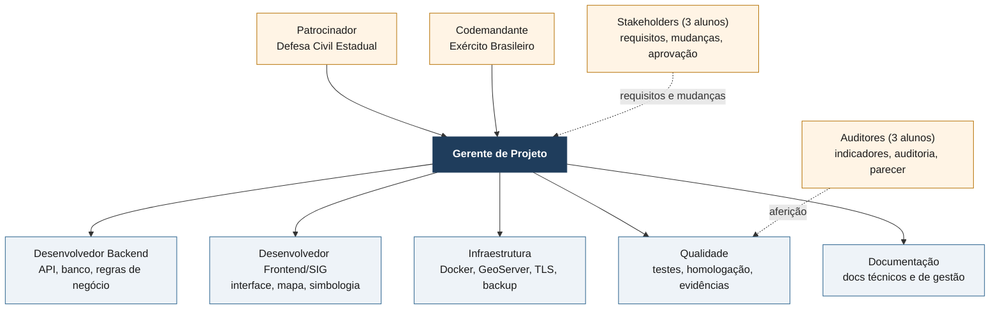

# Organização do projeto e matriz de responsabilidades (RACI)

## Organograma do projeto

Laranja: partes externas à equipe. Linha tracejada: relação funcional
(requisitos, aferição), sem subordinação.

## Papéis e integrantes

Uma pessoa pode acumular papéis. Em equipe pequena, é comum juntar
Backend + Infraestrutura e Qualidade + Documentação. Só **não** junte
*Desenvolvedor* com *quem faz o teste em máquina limpa* (EAP 1.9.3): o RNF-07
exige alguém que não ajudou a construir o sistema.

| Papel | Sigla | Responsabilidades principais | Integrante(s) |
|---|---|---|---|
| Patrocinador | PAT | aprova o termo de abertura, decide mudanças de escopo e prazo, representado pelos Stakeholders no case | Defesa Civil Estadual |
| Stakeholders | STK | definem os requisitos (03/08), julgam mudanças (15 e 22/09), aprovam ou reprovam a entrega (05/10) | 3 alunos |
| Auditores | AUD | definem os indicadores (13/08), auditam a entrega (29/09), emitem o parecer de conformidade (05/10) | 3 alunos |
| Gerente de Projeto | GP | planejamento, cronograma, riscos, comunicação, relatório de situação, pacote de entrega | _(preencher)_ |
| Desenvolvedor Backend | BE | FastAPI, modelo de dados, migrações, triggers, RBAC, auditoria, SITREP, exportação | _(preencher)_ |
| Desenvolvedor Frontend/SIG | FE | React, Leaflet, camadas, simbologia, desenho de polígono, consumo de WMS | _(preencher)_ |
| Infraestrutura | INF | Docker Compose, GeoServer, nginx/TLS, backup e restauração, ambiente de homologação | _(preencher)_ |
| Qualidade | QA | testes automatizados, roteiro de homologação, medições de desempenho e carga, evidências | _(preencher)_ |
| Documentação | DOC | documentação técnica (RNF-08), manual de instalação, conformidade, matriz de rastreabilidade | _(preencher)_ |

## Matriz RACI

**R** — Responsável (executa) · **A** — Aprovador (responde pelo resultado; um
por linha) · **C** — Consultado (opina antes) · **I** — Informado (sabe depois).

| EAP | Entrega | PAT | STK | AUD | GP | BE | FE | INF | QA | DOC |
|---|---|:-:|:-:|:-:|:-:|:-:|:-:|:-:|:-:|:-:|
| 1.1.1 | Termo de abertura | **A** | C | I | R | I | I | I | I | I |
| 1.1.2 | Planos do projeto | I | C | I | **A/R** | C | C | C | C | C |
| 1.1.3 | Monitoramento e relatório de situação | I | I | — | **A/R** | C | C | C | C | C |
| 1.1.4 | Encerramento e lições aprendidas | **A** | I | I | R | C | C | C | C | C |
| 1.2 | Análise de requisitos e matriz de rastreabilidade | C | **A** | I | R | C | C | C | C | R |
| 1.3 | Arquitetura e banco de dados | I | C | — | **A** | R | C | C | I | I |
| 1.4 | API de negócio | — | — | — | **A** | R | C | I | C | I |
| 1.5 | Interface web e mapa | — | C | — | **A** | C | R | I | C | I |
| 1.6 | Interoperabilidade WMS/WFS | — | C | — | **A** | C | R | R | C | I |
| 1.7 | Segurança e conformidade | I | C | C | **A** | R | C | R | C | R |
| 1.8.1 | Testes automatizados | — | — | — | **A** | R | C | — | R | I |
| 1.8.2–1.8.3 | Verificações manuais, desempenho e escala | I | I | C | **A** | C | C | C | R | I |
| 1.9 | Implantação e teste em máquina limpa | I | I | C | **A** | C | I | R | R | C |
| 1.10 | Documentação técnica (RNF-08) | — | I | I | **A** | C | C | C | C | R |
| 1.11.1 | Homologação e evidências | I | C | C | **A** | C | C | C | R | I |
| 1.11.2 | Pacote de entrega (29/09) | I | I | I | **A/R** | C | C | C | C | C |
| 1.11.3 | Parecer e decisão (05/10) | **A** | C | C | R | C | C | I | I | I |
| — | Aprovação de mudança de escopo | **A** | C | I | R | C | C | C | C | I |
