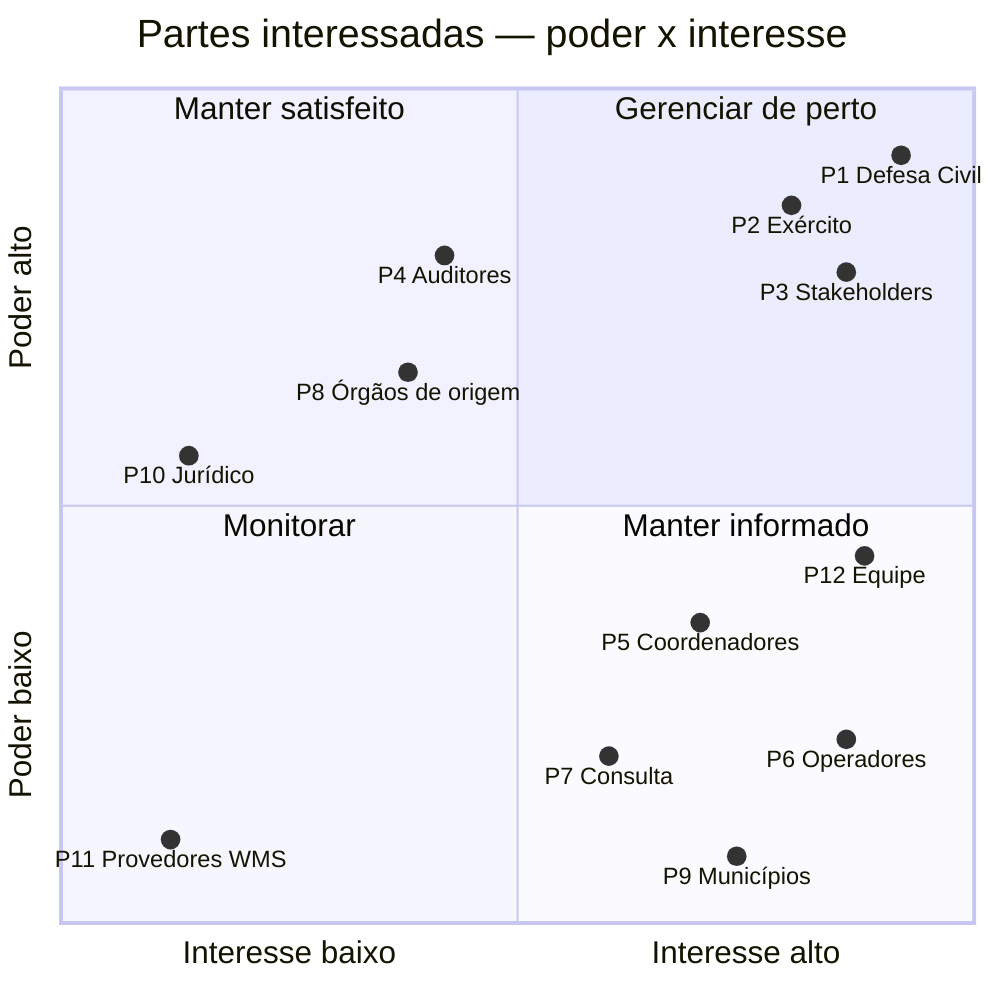

# Partes interessadas e plano de comunicação

## Registro de partes interessadas

| # | Parte interessada | Papel no projeto | Interesse principal | Poder | Interesse | Estratégia |
|---|---|---|---|:-:|:-:|---|
| P1 | Defesa Civil Estadual | patrocinador e principal usuário | coordenar os meios entre órgãos durante chuvas extremas | Alto | Alto | **gerenciar de perto** |
| P2 | Exército Brasileiro | codemandante; órgão de origem de recursos; interesse na IDE-Defesa | interoperabilidade (WMS/WFS), aderência à Portaria GM-MD nº 2.445/2021 | Alto | Alto | **gerenciar de perto** |
| P3 | Stakeholders (3 alunos) | definem os requisitos (03/08), julgam mudanças nas sprints (15 e 22/09) e aprovam ou reprovam a entrega (05/10) | entrega aderente aos 25 requisitos, dentro de escopo, tempo e custo | Alto | Alto | **gerenciar de perto** |
| P4 | Auditores (3 alunos) | definem os indicadores (13/08), auditam a entrega (29/09) e emitem o parecer de conformidade (05/10) | evidências objetivas e sistema reproduzível | Alto | Médio | **manter satisfeito** |
| P5 | Coordenadores (usuários) | operação com escrita total | cadastro de recursos confiável e trilha de auditoria | Médio | Alto | **manter informado** |
| P6 | Operadores (usuários) | operação de campo | empenhar em ≤ 5 interações; mensagens de erro claras | Baixo | Alto | **manter informado** |
| P7 | Usuários de Consulta | leitura da situação | mapa atualizado e SITREP | Baixo | Médio | **manter informado** |
| P8 | Órgãos de origem dos recursos (CBMES, PMES, SAMU) | fornecem equipes e equipamentos | ver onde seus meios estão e por quanto tempo | Médio | Médio | **manter satisfeito** |
| P9 | Municípios atingidos | beneficiários indiretos | atendimento mais rápido | Baixo | Alto | **manter informado** (via Defesa Civil) |
| P10 | Assessoria jurídica / compliance do órgão | valida LGPD e IDE-Defesa | conformidade legal antes da produção | Médio | Baixo | **manter satisfeito** |
| P11 | Provedores de WMS externo (INDE, IBGE) | fornecem camadas consumidas | nenhum (não sabem do projeto) | Baixo | Baixo | **monitorar** |
| P12 | Equipe do projeto | constrói e entrega | escopo estável e prazo viável | Médio | Alto | **manter informado** |

## Matriz poder × interesse

## Plano de comunicação

| # | Comunicação | Objetivo | Público | Frequência / data | Meio | Responsável | Registro |
|---|---|---|---|---|---|---|---|
| C1 | Recebimento dos requisitos | alinhar objetivos, escopo e marcos | P3, equipe | 03/08/2026 | reunião (presencial ou vídeo) | GP | ata + [termo de abertura](termo-abertura.md) |
| C2 | Reunião semanal da equipe | acompanhar o avanço, resolver impedimentos, revisar riscos | equipe | semanal, segunda-feira | reunião curta (≤ 30 min) | GP | ata + atualização do [relatório de situação](status-projeto.md) |
| C3 | Acompanhamento diário | tirar dúvidas e sinalizar bloqueios | equipe | diário | grupo de mensagens | todos | — |
| C4 | Relatório de situação | informar o semáforo, as pendências e os riscos | P1, P2, P3 | semanal, sexta-feira | e-mail com link para [status-projeto.md](status-projeto.md) | GP | e-mail enviado |
| C5 | Solicitação de mudança | pedir alteração de escopo, prazo ou requisito | P3 → GP → P1 | sob demanda | formulário do [controle de mudanças](controle-mudancas.md) | quem solicita | registro de mudanças |
| C6 | Revisão técnica de código e documentação | garantir que o código e a documentação contam a mesma história | BE, FE, INF, DOC | a cada entrega relevante | *pull request* no repositório | autor da mudança | histórico do repositório |
| C7 | Recebimento dos indicadores de auditoria | alinhar o roteiro de verificação da matriz de rastreabilidade ao framework dos Auditores | P4, QA, GP | 13/08/2026 | reunião | GP | roteiro de verificação |
| C8 | Sprints parciais | apresentar o andamento; Stakeholders julgam as solicitações de mudança | P3, equipe | 15/09 e 22/09/2026 | apresentação | GP + desenvolvedores | ata + decisões sobre mudanças |
| C9 | Entrega e auditoria | entregar sistema, documentação e evidências; Auditores auditam com base nos indicadores | P3, P4 | 29/09/2026 | entrega + sessão de auditoria | GP | protocolo de entrega |
| C10 | Parecer e decisão | ações corretivas recomendadas (30/09 a 02/10); parecer de conformidade e aprovação ou reprovação | P3, P4, equipe | 05/10/2026 | apresentação | GP + desenvolvedores | parecer + decisão |
| C11 | Lições aprendidas | registrar o que repetir e o que evitar | equipe | após 05/10/2026 | reunião de retrospectiva | GP | documento de lições aprendidas |

### Regras de comunicação

- **Escalonamento:** impedimento sem solução em 1 dia útil sobe para o GP; se
  afetar o caminho crítico ([cronograma](cronograma.md)), o GP avisa o
  patrocinador no mesmo dia, sem esperar o relatório de sexta.
- **Fonte única da verdade:** requisitos → [matriz de rastreabilidade](../matriz-rastreabilidade.md);
  escopo → [EAP](eap.md); datas → [cronograma](cronograma.md). Decisão tomada
  em conversa só vale depois de registrada num desses documentos.
- **Dados pessoais:** relatórios e apresentações não trazem dados pessoais de
  usuários do sistema (LGPD — ver [conformidade.md](../conformidade.md)); nas
  demonstrações, use dados gerados por `seed_escala.py`.
