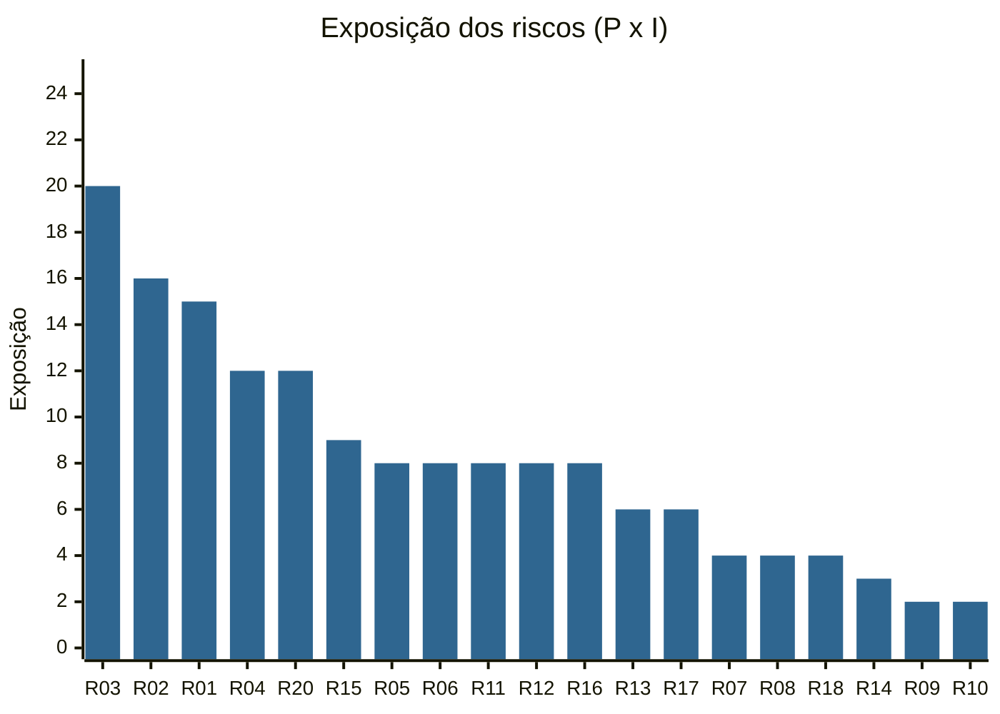

# Gerenciamento de riscos

Registro mantido pela **equipe de Desenvolvimento**. Revisão de **21/09/2026**:
depois da sprint parcial 1 (15/09) e antes da sprint parcial 2 (22/09).
Revisado a cada sprint e antes da entrega ([cronograma](cronograma.md)).

## Escalas

| Nota | Probabilidade (P) | Impacto (I) |
|:-:|---|---|
| 1 | muito baixa (< 10%) | desprezível: nenhum requisito afetado |
| 2 | baixa (10–30%) | pequeno: requisito **desejável** afetado, ou retrabalho < 1 dia |
| 3 | média (30–50%) | moderado: retrabalho de 1–2 dias, sem ameaçar a entrega |
| 4 | alta (50–70%) | grande: requisito **obrigatório** em risco ou caminho crítico atrasado |
| 5 | muito alta (> 70%) | crítico: entrega de 29/09 ou aprovação em 05/10 em risco |

**Exposição = P × I** · 🟥 alta (≥ 15) · 🟨 média (8–14) · 🟩 baixa (≤ 7).

## Matriz de probabilidade × impacto

Riscos em *itálico* já foram tratados; aparecem na posição **residual**.

| Impacto ↓ / Probabilidade → | 1 muito baixa | 2 baixa | 3 média | 4 alta | 5 muito alta |
|---|:-:|:-:|:-:|:-:|:-:|
| **5 crítico** | 🟩 | 🟨 | 🟥 **R01** | 🟥 **R03** | 🟥 |
| **4 grande** | 🟩 *R07 · R08* | 🟨 R05 · R11 · R16 | 🟨 R04 · R20 | 🟥 **R02** | 🟥 |
| **3 moderado** | 🟩 *R14* | 🟩 R13 · R17 | 🟨 R15 | 🟨 | 🟥 |
| **2 pequeno** | 🟩 *R09* | 🟩 R18 | 🟩 | 🟨 R06 · R12 | 🟨 |
| **1 desprezível** | 🟩 | 🟩 R10 | 🟩 | 🟩 | 🟩 |

## Exposição por risco

## Registro de riscos

Estratégias: **Evitar** (eliminar a causa) · **Mitigar** (reduzir P ou I) ·
**Transferir** · **Aceitar** (ativo = plano de contingência pronto; passivo =
só monitorar).

### 🟥 Exposição alta

| ID | Risco (se… então…) | Req. | P | I | Exp. | Estratégia e ações | Dono | Prazo |
|---|---|---|:-:|:-:|:-:|---|---|---|
| **R03** | **Se** os requisitos verificados manualmente não tiverem evidência (print, vídeo, saída de comando) organizada segundo os indicadores dos Auditores, **então** eles podem ser reprovados na auditoria de 29/09 | RF-08 a RF-11, RF-15, RNF-01, RNF-04 a RNF-10 | 4 | 5 | **20** | **Mitigar:** para cada indicador definido pelos Auditores em 13/08, um passo de verificação e uma evidência nomeada pelo ID do requisito (`RF-08_mapa_camadas.png`), reunidas na atividade K | Qualidade | 24/09 |
| **R02** | **Se** só quem construiu o núcleo do sistema souber explicá-lo, **então** a apresentação das sprints e as respostas aos Auditores dependem de uma pessoa | todos | 4 | 4 | **16** | **Mitigar:** sessão de repasse do código para os 9 desenvolvedores antes da sprint 2; pelo menos 2 pessoas sobem o sistema e demonstram o fluxo de empenho sozinhas | Gerente de projeto | 22/09 |
| **R01** | **Se** um terceiro levar mais de 60 min para instalar o sistema numa máquina limpa (download de ~3 GB de imagens, build, subida do GeoServer), **então** o RNF-07 (obrigatório) falha | RNF-07 | 3 | 5 | **15** | **Mitigar:** ensaio cronometrado com alguém de fora da equipe (atividade L, 25/09), anotando o tempo de cada passo do [manual](../manual-instalacao.md). **Contingência:** separar `docker compose pull` como passo prévio no manual | Infraestrutura | 25/09 |

### 🟨 Exposição média

| ID | Risco (se… então…) | Req. | P | I | Exp. | Estratégia e ações | Dono | Prazo |
|---|---|---|:-:|:-:|:-:|---|---|---|
| R04 | **Se** a verificação (K) encontrar defeito em requisito obrigatório, **então** não há folga no caminho crítico para corrigir antes de 29/09 | todos | 3 | 4 | 12 | **Mitigar:** escopo congelado desde a sprint 1; corrigir primeiro os obrigatórios; usar o dia de ajustes finais (M, 28/09) como reserva | Gerente de projeto | 28/09 |
| R20 | **Se** os Auditores recomendarem ações corretivas em 29/09, **então** há só 3 dias úteis (30/09 a 02/10) para executá-las antes do parecer de 05/10 | todos | 3 | 4 | 12 | **Mitigar:** equipe de plantão de 30/09 a 02/10; priorizar as ações que mudam o parecer de reprovação para aprovação; responder por escrito o que não couber no prazo | Gerente de projeto | 02/10 |
| R15 | **Se** a aderência à LGPD e à Portaria GM-MD nº 2.445/2021 for questionada, **então** o RNF-09 pode ser apontado no parecer | RNF-09 | 3 | 3 | 9 | **Mitigar:** apresentar [conformidade.md](../conformidade.md) com as medidas técnicas; pedir apoio aos professores da Seção para revisar o texto normativo | Documentação | 25/09 |
| R05 | **Se** o mapa inicial passar de 5 s ou a busca por raio passar de 3 s com 1.000 recursos, **então** o RNF-04 (obrigatório) falha | RNF-04 | 2 | 4 | 8 | **Mitigar:** medir na atividade K com `seed_escala --recursos 1000`; se falhar, otimizar a consulta | Qualidade | 24/09 |
| R06 | **Se** não houver script de carga para 20 usuários simultâneos, **então** o RNF-10 (desejável) não pode ser aferido pelos Auditores | RNF-10 | 4 | 2 | 8 | **Mitigar:** script `k6` ou `locust` simples. **Aceitar** se não houver tempo, registrando como "não verificado" | Qualidade | 24/09 |
| R11 | **Se** a máquina da auditoria tiver menos de 4 GB de RAM ou portas ocupadas, **então** o GeoServer não sobe ou o proxy falha | RNF-07 | 2 | 4 | 8 | **Mitigar:** requisitos de máquina no [manual](../manual-instalacao.md); porta do console do GeoServer configurável (`GEOSERVER_PORTA_HOST`) | Infraestrutura | 25/09 |
| R12 | **Se** o certificado autoassinado gerar alerta no navegador, **então** os Auditores podem questionar se o HTTPS "vale" | RNF-06 | 4 | 2 | 8 | **Mitigar:** explicar no roteiro e mostrar TLS 1.2/1.3 ativo; certificado de autoridade certificadora fica para produção | Qualidade | 29/09 |
| R16 | **Se** os Stakeholders aprovarem mudança de escopo na sprint 2 (22/09), **então** o caminho crítico sem folga não absorve | todos | 2 | 4 | 8 | **Evitar:** toda solicitação chega com análise de impacto no cronograma ([controle de mudanças](controle-mudancas.md)) para os Stakeholders julgarem sabendo o custo | Gerente de projeto | 22/09 |

### 🟩 Exposição baixa

| ID | Risco (se… então…) | Req. | P | I | Exp. | Estratégia e ações | Dono | Prazo |
|---|---|---|:-:|:-:|:-:|---|---|---|
| R13 | **Se** o `.env` da auditoria mantiver as senhas de exemplo, **então** o RNF-06 fica fragilizado | RNF-06 | 2 | 3 | 6 | **Mitigar:** gerar os segredos com `openssl rand -hex 24`, como manda o manual | Infraestrutura | 29/09 |
| R17 | **Se** um usuário for inativado, **então** ele continua usando a API até o token expirar (até 8 h); as camadas OGC já checam isso a cada requisição | RF-12 | 2 | 3 | 6 | **Aceitar (passivo):** registrar como melhoria futura | Backend | — |
| R18 | **Se** o controle de acesso ao GeoServer falhar no ambiente da auditoria, **então** as camadas WMS do GeoServer não carregam no mapa | RF-11 | 2 | 2 | 4 | **Aceitar (ativo):** as camadas operacionais vêm da API e não dependem do GeoServer; o manual traz a solução | Infraestrutura | 25/09 |
| R10 | **Se** o provedor WMS externo sair do ar durante a auditoria, **então** a camada externa não carrega | RF-15 | 2 | 1 | 2 | **Aceitar (ativo):** o sistema continua funcionando — é exatamente o que o RF-15 pede | Frontend | — |

## Riscos tratados na sprint 1

Problemas encontrados na revisão e corrigidos entre 15 e 18/09 (atividade Q do
[cronograma](cronograma.md)).

| ID | Risco original | Tratamento aplicado | Exposição antes → residual | Dono |
|---|---|---|:-:|---|
| R07 | API e GeoServer respondendo em HTTP puro para a rede — RNF-06 | portas publicadas só em `127.0.0.1`; Swagger em `https://<host>/api/docs` | 12 → **4** | Infraestrutura |
| R08 | WMS/WFS do GeoServer acessíveis sem login — RNF-09 | nginx consulta a API (`auth_request`) antes de cada acesso; só usuário ativo passa | 12 → **4** | Infraestrutura |
| R09 | Nenhuma camada WMS externa cadastrada e nenhuma tela para cadastrar — RF-15 | tela "Camadas externas" e camada de exemplo "Hidrografia (IBGE)" | 8 → **2** | Frontend |
| R14 | `camadas_externas` sem trigger de auditoria — RF-13 | migração `0002` estende a trilha; teste cobre inclusão e alteração | 9 → **3** | Backend |

## Riscos encerrados

| ID | Risco | Como foi encerrado |
|---|---|---|
| RE1 | Duplo empenho sob requisições simultâneas (OBJ-3) | índice único parcial `uq_empenho_ativo_por_recurso`, coberto por teste contra o banco |
| RE2 | Trilha de auditoria editável pela aplicação (RF-13) | papel da API sem permissão de escrita em `auditoria`; gravação só por trigger |
| RE3 | Arquitetura dual vedada (RNF-01) | API e GeoServer leem o mesmo PostGIS |
| RE4 | Distância calculada em graus em vez de metros | `ST_Transform` para 4326 + `geography` |
| RE5 | Scripts `.sh` com quebra de linha do Windows | `.gitattributes` força `eol=lf` |
| RE6 (R19) | Regressão introduzida pelas correções da sprint 1 | suíte executada em 21/09 no ambiente Docker: 36 testes passando; sistema verificado por HTTPS e WMS com e sem login |
