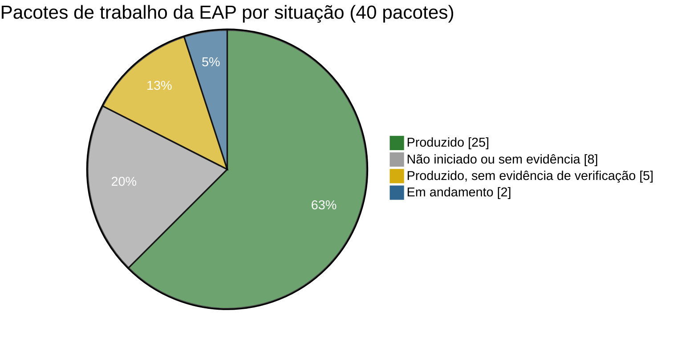
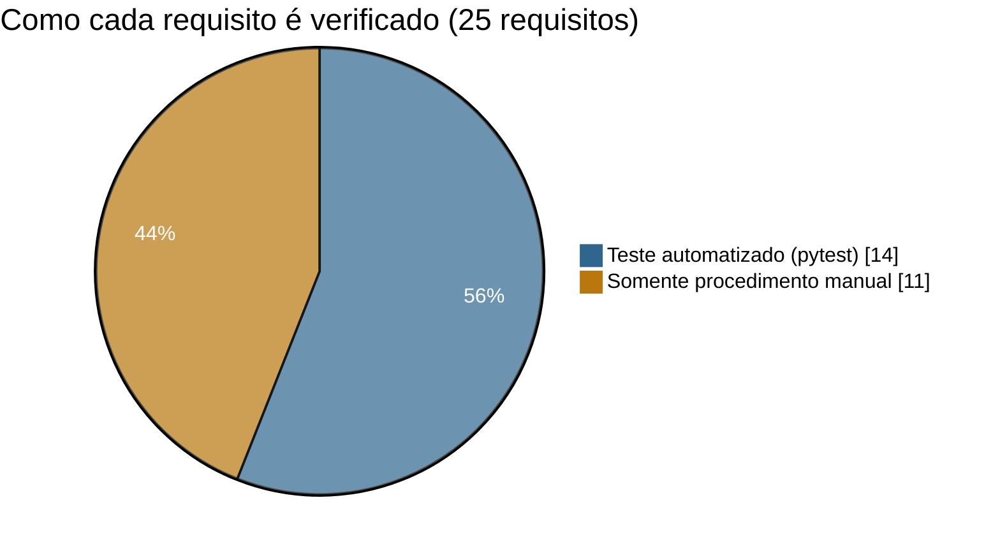

# Relatório de situação do projeto

| Campo | Valor |
|---|---|
| Data de referência | **segunda, 21/09/2026** — depois da sprint parcial 1, véspera da sprint parcial 2 |
| Equipe | Desenvolvimento (9 alunos) |
| Fase | verificação contra os indicadores dos Auditores (atividade K do [cronograma](cronograma.md)) |
| Próximos marcos | sprint parcial 2 (22/09) · entrega e auditoria (29/09) · parecer e decisão (05/10) |

## Resumo executivo

O **desenvolvimento está concluído**: backend, frontend, banco PostGIS,
publicação OGC, implantação por Docker Compose, testes automatizados e toda a
documentação técnica exigida pelo RNF-08. Os 25 requisitos têm componente e
forma de verificação na [matriz de rastreabilidade](../matriz-rastreabilidade.md),
alinhada aos indicadores que os Auditores definiram em 13/08.

Na **sprint parcial 1 (15/09)** a revisão encontrou 4 pontos que podiam custar
requisitos na auditoria (Q1 a Q4). Os quatro foram **corrigidos entre 15 e
18/09**, com testes automatizados novos, e não houve mudança de escopo.

Em 21/09 o sistema foi **implantado com Docker Compose** e verificado: os
6 containers sobem, a API responde por HTTPS, o WMS recusa acesso sem login
(401) e, com login, publica `recursos` e `ocorrencias` em EPSG:4674. A suíte
automatizada foi executada no mesmo ambiente: **36 testes, todos passando**,
incluindo os das correções da sprint 1. Código e documentação estão em
<https://github.com/viniciusbrito1/GeoProjeto_SIG>.

Falta, até 29/09: reunir as evidências por indicador dos Auditores e fazer o
teste de instalação por alguém de fora da equipe.

## Semáforo

| Dimensão | Situação | Comentário |
|---|:-:|---|
| Escopo | 🟢 | 25/25 requisitos com componente implementado; nenhuma mudança de escopo aprovada nas sprints |
| Cronograma | 🟡 | tudo no prazo, mas o caminho crítico (K → L → M) ocupa os 6 dias úteis até a entrega |
| Qualidade | 🟡 | 36 testes automatizados passando (14 requisitos cobertos); 11 requisitos dependem de verificação manual, com evidência em montagem |
| Riscos | 🟡 | 3 riscos altos: evidências (R03), conhecimento concentrado (R02), instalação em máquina limpa (R01) — ver [riscos](riscos.md) |
| Custos | 🟢 | somente software livre; sem custo de licença |

## Avanço da EAP

Detalhe por pacote: [dicionário da EAP](eap.md#dicionário-da-eap).

## Cobertura de verificação

Dos **19 obrigatórios**, 11 têm teste automatizado e 8 dependem de
procedimento manual. A relação completa, requisito a requisito, está na
[matriz de rastreabilidade](../matriz-rastreabilidade.md).

## Correções feitas após a sprint parcial 1

| ID | Problema encontrado | Requisito | Correção (15 a 18/09) |
|---|---|---|---|
| **Q1** | API e GeoServer acessíveis em HTTP puro pela rede | RNF-06 | portas publicadas só no loopback; documentação da API em `https://<host>/api/docs` |
| **Q2** | WMS/WFS do GeoServer sem login | RNF-09, RF-11 | nginx consulta a API antes de cada acesso; só usuário ativo passa (sessão do mapa, QGIS com e-mail e senha, ou token) |
| **Q3** | Nenhuma camada WMS externa cadastrada e nenhuma tela de cadastro | RF-15 | tela "Camadas externas" e camada de exemplo "Hidrografia (IBGE)" |
| **Q4** | Tabela `camadas_externas` sem trilha de auditoria | RF-13 | migração 0002 estende a auditoria; teste cobre inclusão e alteração |

## Próximos passos até a entrega

| Data | Ação | Responsável |
|---|---|---|
| ✅ seg 21/09 | sistema implantado em Docker e verificado; `pytest`: 36 testes passando; código publicado no GitHub | Backend · Gerente de projeto |
| ter 22/09 | repasse do código para a equipe | Gerente de projeto |
| **ter 22/09** | **sprint parcial 2**: apresentar correções, testes e documentação; Stakeholders julgam eventuais mudanças | toda a equipe |
| 21 a 24/09 | verificação de cada requisito contra os indicadores dos Auditores, com evidência nomeada por requisito; medições de desempenho (RNF-04) e carga (RNF-10) | Qualidade |
| sex 25/09 | teste de instalação em máquina limpa por alguém de fora da equipe, cronometrado (RNF-07) | Infraestrutura |
| seg 28/09 | ajustes finais e fechamento do pacote de entrega | toda a equipe |
| **ter 29/09** | **entrega e auditoria** | Gerente de projeto |
| 30/09 a 02/10 | executar as ações corretivas recomendadas pelos Auditores | toda a equipe |
| **seg 05/10** | **parecer de conformidade e aprovação ou reprovação** | Auditores · Stakeholders |

## Lições aprendidas (preliminares)

| # | O que aconteceu | Lição |
|---|---|---|
| L1 | A documentação de gestão foi consolidada depois do desenvolvimento | publicar EAP, cronograma e riscos logo após receber os requisitos (03/08) |
| L2 | A folga entre o fim do desenvolvimento e a entrega é pequena | começar a verificação contra os indicadores dos Auditores (13/08) durante o desenvolvimento, não só no fim |
| L3 | Os requisitos mais críticos (duplo empenho, auditoria não editável) foram garantidos no próprio banco | resolver requisitos críticos "por construção", e não só por convenção de código |
| L4 | Q1 a Q4 só apareceram quando alguém leu o código contra os documentos | fazer revisão cruzada (código × requisito × documentação) antes de cada sprint |
