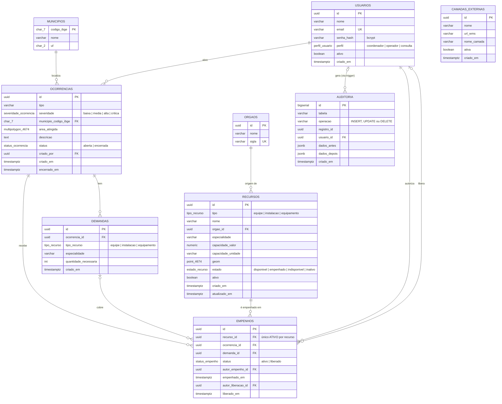
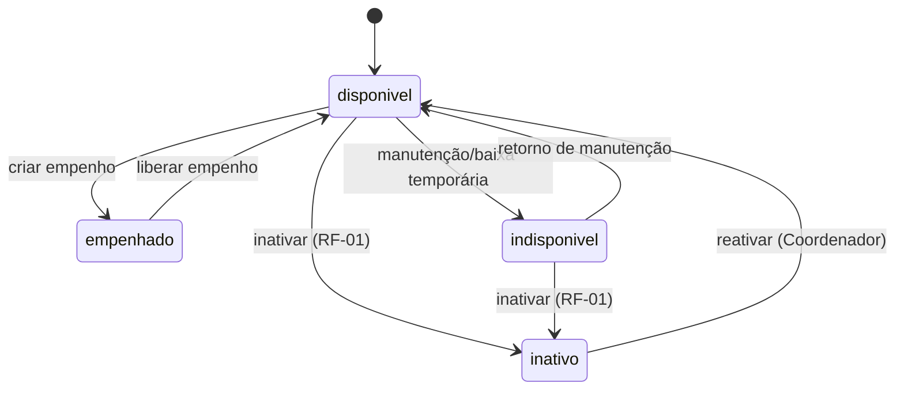

# Modelo de dados

Schema completo (tipos, tabelas, índices, triggers, permissões):
[`backend/alembic/versions/0001_schema_inicial.py`](../backend/alembic/versions/0001_schema_inicial.py)
e [`0002_auditoria_camadas_externas.py`](../backend/alembic/versions/0002_auditoria_camadas_externas.py) —
são a fonte da verdade; este documento explica as decisões de desenho.

## Diagrama entidade-relacionamento



### Correspondência com o diagrama de classes

O diagrama ER e o [diagrama de classes](uml/classes.md) são gerados da **mesma
definição do modelo**: cada tabela corresponde a uma classe, com os mesmos
atributos, os mesmos relacionamentos (mesmo nome) e as mesmas cardinalidades.

| Tabela (ER) | Classe (UML) | Relacionamentos |
|---|---|---|
| `USUARIOS` | `Usuario` | abre Ocorrência (1:0..*) · autoriza Empenho (1:0..*) · libera Empenho (0..1:0..*) · gera Auditoria (0..1:0..*) |
| `ORGAOS` | `Orgao` | origem de Recurso (1:0..*) |
| `MUNICIPIOS` | `Municipio` | localiza Ocorrência (1:0..*) |
| `RECURSOS` | `Recurso` | é empenhado em Empenho (1:0..*) |
| `OCORRENCIAS` | `Ocorrencia` | tem Demanda (1:0..*) · recebe Empenho (1:0..*) |
| `DEMANDAS` | `Demanda` | cobre Empenho (0..1:0..*) |
| `EMPENHOS` | `Empenho` | — (lado "muitos" de 5 relacionamentos) |
| `AUDITORIA` | `Auditoria` | — (lado "muitos" de *gera*) |
| `CAMADAS_EXTERNAS` | `CamadaExterna` | nenhum — cadastro independente (RF-15) |

Os tipos enumerados do banco (`perfil_usuario`, `tipo_recurso`,
`estado_recurso`, `severidade_ocorrencia`, `status_ocorrencia`,
`status_empenho`) aparecem no diagrama de classes como as enumerações
`PerfilUsuario`, `TipoRecurso`, `EstadoRecurso`, `SeveridadeOcorrencia`,
`StatusOcorrencia` e `StatusEmpenho`, com os mesmos valores.

`AUDITORIA.usuario_id` é uma referência **lógica** a `USUARIOS`: não há
constraint de chave estrangeira no banco, porque o trigger precisa gravar a
trilha mesmo quando a escrita não vem de um usuário autenticado (por exemplo,
cargas de dados iniciais) — daí a cardinalidade 0..1.

## Decisões que valem explicação

**Por que `empenhos` é log append-only, e não um campo em `recursos`.**
Guardar só "recursos.ocorrencia_atual_id" perderia o histórico (quem
empenhou, quando, quem liberou — exigido pelo RF-05). `empenhos` é um
registro de eventos; o estado atual do recurso (`recursos.estado`) é
derivado, mantido em sincronia pela mesma transação que grava o empenho.

**O índice que impede duplo empenho.**
```sql
CREATE UNIQUE INDEX uq_empenho_ativo_por_recurso
    ON empenhos(recurso_id) WHERE status = 'ativo';
```
Um índice único *parcial*: a restrição de unicidade em `recurso_id` só vale
entre as linhas com `status = 'ativo'`. Um recurso pode ter dez empenhos
*liberados* no histórico, mas nunca dois *ativos* ao mesmo tempo — e isso é
verdade mesmo sob concorrência, porque é o próprio Postgres que rejeita o
segundo `INSERT`, não uma checagem em Python que pode perder uma corrida.
É a peça central que faz OBJ-3 ("duplo empenho impossível pelo sistema")
uma garantia estrutural.

**Máquina de estados de `recursos.estado` (RF-02).**

Validada em duas camadas, mas não com a mesma regra: um trigger `BEFORE
UPDATE OF estado` no Postgres rejeita qualquer transição fora desta tabela
(a garantia real, vale para qualquer caminho de código). Já o endpoint
genérico `PATCH /recursos/{id}/estado` aplica uma regra **mais restrita** em
Python — ele recusa qualquer transição de/para `empenhado`, mesmo sendo
válida na tabela acima — porque virar `empenhado` tem um efeito colateral
(criar o registro de `Empenho`) que só `POST /api/empenhos` sabe fazer
direito; permitir isso pelo PATCH genérico deixaria o recurso marcado como
empenhado sem nenhum empenho correspondente. O serviço de empenhos
([`services/empenhos.py`](../backend/app/services/empenhos.py)) muda
`recursos.estado` diretamente (sem passar por esse endpoint), continuando
sujeito só ao trigger. Em ambos os casos, a mensagem de erro em português
com a transição corretiva sugerida (RNF-05) evita esperar o banco recusar.

**Auditoria gravada por trigger, não pela aplicação (RF-13).**
Toda tabela que a API escreve (`recursos`, `ocorrencias`, `demandas`, `empenhos`,
`usuarios` — migração 0001 — e `camadas_externas` — migração 0002) tem um
trigger `AFTER INSERT OR UPDATE OR DELETE` que chama
`fn_auditoria()`, uma função `SECURITY DEFINER` que grava tabela, operação,
usuário (lido de `current_setting('app.current_user_id')`, que a API define
no início de cada requisição autenticada), e o `jsonb` de antes/depois via
`to_jsonb(OLD)`/`to_jsonb(NEW)`. O papel de conexão da API não tem `GRANT` de
escrita em `auditoria` — só o trigger, rodando com os privilégios do dono do
schema, consegue inserir ali. Não existe rota HTTP de escrita na auditoria
porque não faria diferença: mesmo que existisse, o papel da API não
conseguiria executá-la.

**SIRGAS 2000 / EPSG:4674 em todo lugar (RNF-02).**
Todas as colunas de geometria são `geometry(<tipo>, 4674)` — o SRID é parte
do tipo da coluna, não uma convenção documentada à parte. Toda saída da API
(GeoJSON) inclui um membro `crs` explícito apontando para
`urn:ogc:def:crs:EPSG::4674`, e o WMS/WFS do GeoServer declara o mesmo SRS
no `GetCapabilities`.

**Distância em metros sobre um SRC geográfico.**
EPSG:4674 é geográfico (graus), então `ST_Distance` direto retornaria graus,
não metros. As consultas de raio (RF-07) e de proximidade (RF-06) fazem
`CAST(coluna AS geography)` antes de `ST_Distance`/`ST_DWithin` — o tipo
`geography` do PostGIS calcula distância geodésica em metros diretamente,
sem precisar escolher uma projeção UTM (que mudaria de zona dentro do
próprio estado). O cast `::geography` do PostGIS só aceita geometria em
SRID 4326 (WGS84) — tentar com 4674 direto falha em tempo de execução
("Geometry SRID (4674) does not match column SRID (4326)"), então o helper
`_geography()` em [`services/recursos.py`](../backend/app/services/recursos.py)
faz `ST_Transform(coluna, 4326)` antes do cast. SIRGAS2000 e WGS84 são
geograficamente quase idênticos (poucos centímetros de diferença no
território brasileiro), então essa transformação não compromete a precisão
nem a exigência de performance do RNF-04 — o dado em si continua
armazenado em 4674 (RNF-02); a transformação existe só para este cálculo.
