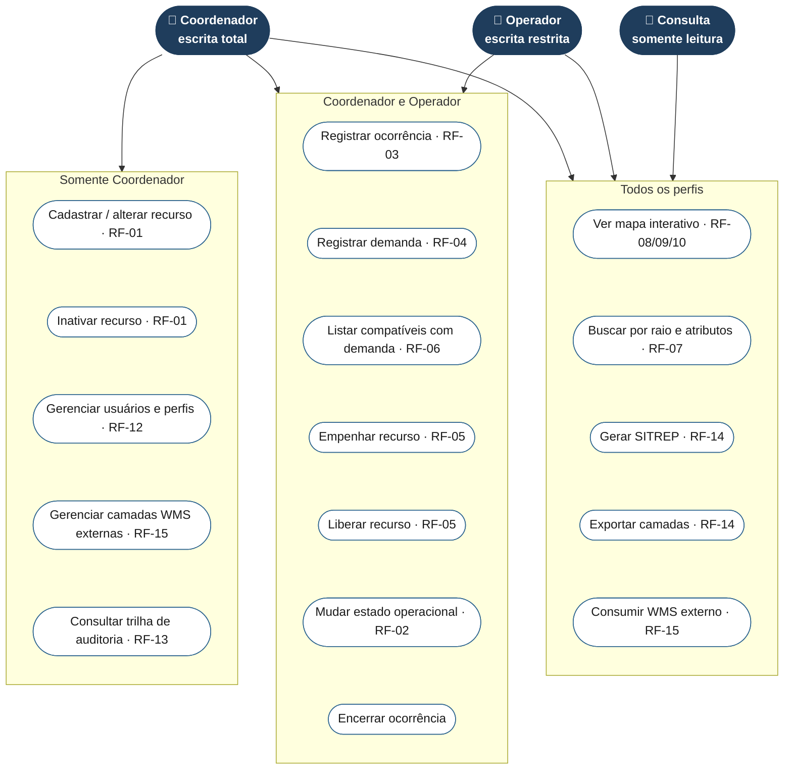

# Diagrama de casos de uso

Mermaid não tem um tipo nativo de diagrama de casos de uso UML; a notação
abaixo usa um fluxograma. Os casos de uso estão agrupados por **quem pode
executá-los**: a seta de um ator para um grupo significa que ele executa todos
os casos de uso daquele grupo.

## Atores

| Ator | Descrição |
|---|---|
| **Coordenador** | escrita total (RF-12): cadastro mestre de recursos, gestão de usuários, auditoria, e tudo que o Operador faz |
| **Operador** | escrita restrita às operações de campo: ocorrências, demandas, empenho/liberação, mudança de estado operacional |
| **Consulta** | somente leitura: mapa, buscas, relatórios — nenhuma ação de escrita |

## Caso de uso principal: empenhar recurso (CEN-1)

1. Operador (ou Coordenador) abre uma ocorrência com demanda descoberta.
2. Sistema lista recursos disponíveis e compatíveis, ordenados por distância (RF-06).
3. Usuário escolhe um recurso e confirma o empenho.
4. Sistema registra o empenho (autor, data/hora), muda o estado do recurso
   para "empenhado" e atualiza o saldo da demanda — tudo em uma única
   transação (RF-05).
5. Em até 5 interações a partir da tela de demandas (RNF-05) e refletido em
   qualquer outra sessão conectada em até 60s (RF-10, OBJ-2).

Este é o fluxo detalhado, passo a passo técnico, em
[sequencia-empenho.md](sequencia-empenho.md).
