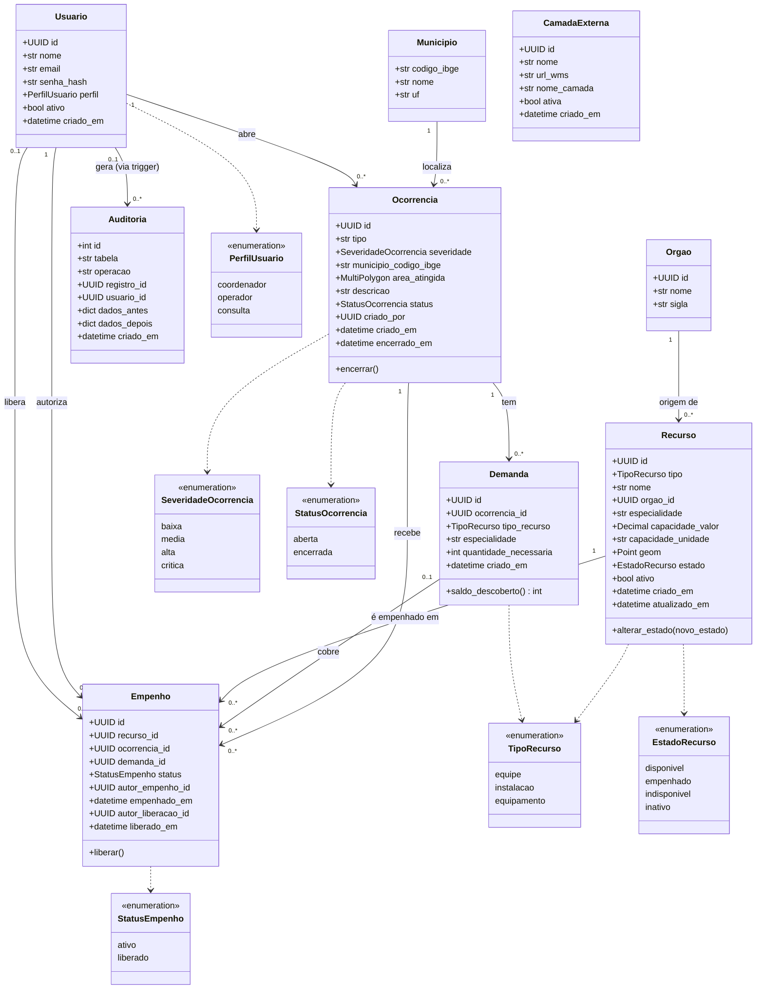

# Diagrama de classes

Reflete os modelos SQLAlchemy em [`backend/app/models/`](../../backend/app/models/),
que espelham o schema do banco. Este diagrama e o [diagrama ER](../modelo-dados.md)
são gerados da **mesma definição do modelo**: cada classe corresponde a uma
tabela, com os mesmos atributos, relacionamentos e cardinalidades (tabela de
correspondência em [modelo-dados.md](../modelo-dados.md)).

## Notas de desenho

- `Recurso.alterar_estado()` e `Ocorrencia.encerrar()` estão representados
  como métodos de domínio para legibilidade do diagrama, mas na
  implementação vivem na camada de serviço
  ([`backend/app/services/`](../../backend/app/services/)) — os modelos
  SQLAlchemy em si são anêmicos (armazenam estado, não comportamento). A
  regra que esses métodos protegem é reforçada de novo no banco (trigger +
  constraint), então a "lógica" real não depende de nenhuma dessas duas
  camadas isoladamente.
- `Auditoria` não aparece com métodos de escrita porque não tem nenhum — é
  populada só pelo trigger `fn_auditoria()` (ver
  [modelo-dados.md](../modelo-dados.md)), nunca pela camada de aplicação.
  O vínculo *Usuario gera Auditoria* é 0..1 porque `usuario_id` é uma
  referência **lógica** (sem constraint de chave estrangeira): o trigger grava
  a trilha mesmo quando a escrita não vem de um usuário autenticado.
- `Empenho` tem dois vínculos com `Usuario`: quem **autoriza** o empenho
  (sempre existe, 1) e quem **libera** (só existe depois da liberação, 0..1).
- Um `Empenho` é imutável quanto ao vínculo `Recurso`↔`Ocorrencia`: para
  mudar de recurso, libera-se o empenho atual e cria-se outro. Isso mantém o
  histórico (RF-05) sempre correto.
