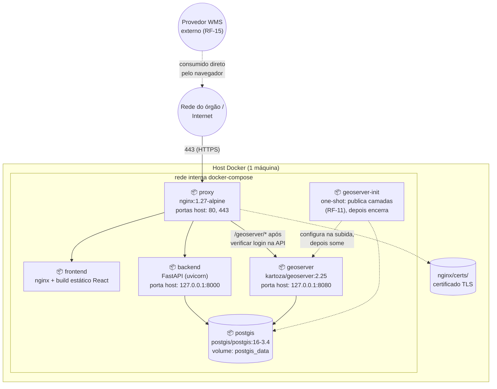

# Diagrama de implantação

Topologia dos containers Docker Compose ([`docker-compose.yml`](../../docker-compose.yml))
numa única máquina (o RNF-07 pede implantação em uma máquina limpa em até 60
minutos — não há dependência de infraestrutura distribuída).

## Requisitos de máquina

| Item | Mínimo recomendado |
|---|---|
| CPU | 2 vCPU |
| RAM | 4 GB (GeoServer sozinho pede ~1 GB) |
| Disco | 10 GB livres (volumes crescem com o histórico de auditoria e os dados espaciais) |
| Software | Docker Engine + Docker Compose plugin |
| Rede | portas 80 e 443 livres; 8000 e 8080 livres no loopback (`127.0.0.1`) — usadas só para diagnóstico e administração local, nunca expostas à rede (RNF-06) |

## Por que um `geoserver-init` que "aparece e some"

GeoServer não vem com workspace/datastore/camadas pré-configurados — isso
normalmente é um passo manual no console web. `geoserver-init`
([`geoserver/init_geoserver.sh`](../../geoserver/init_geoserver.sh)) é um
container *one-shot*: sobe depois que `geoserver` e `backend` estão
saudáveis, chama a REST API do GeoServer para criar o workspace `siscoord`,
o datastore PostGIS e publicar as camadas `recursos`/`ocorrencias`, e
termina. É reexecutável sem efeito colateral (idempotente) — rodar
`docker compose up` de novo não duplica nada.

## Passo a passo de implantação

Ver [manual-instalacao.md](../manual-instalacao.md) para o procedimento
completo, escrito para alguém que nunca viu o projeto (RNF-07).
