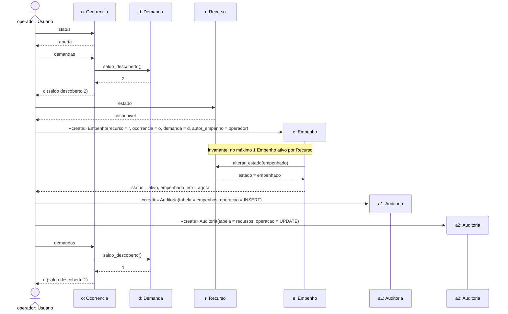
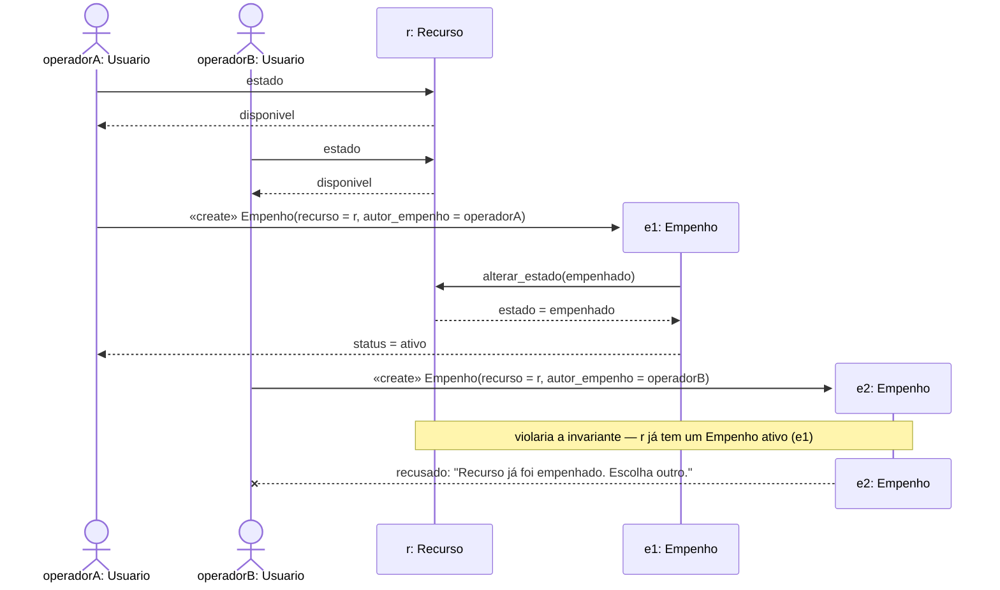

# Diagramas de sequência

Cada linha de vida é um **objeto de uma classe do [diagrama de classes](classes.md)**
(`Usuario`, `Ocorrencia`, `Demanda`, `Recurso`, `Empenho`, `Auditoria`), no
formato `objeto: Classe`. As mensagens são operações dessas classes
(`saldo_descoberto()`, `alterar_estado()`, `liberar()`, criação de objeto) e
só percorrem associações que existem no diagrama de classes:

| Mensagem | Associação usada (diagrama de classes) |
|---|---|
| `operador` cria (`«create»`) `e: Empenho` | Usuario **autoriza** Empenho (1 : 0..*) |
| `o` consulta `d.saldo_descoberto()` | Ocorrencia **tem** Demanda (1 : 0..*) |
| `e` chama `r.alterar_estado()` | Recurso **é empenhado em** Empenho (1 : 0..*) |
| `e` se vincula a `o` e a `d` | Ocorrencia **recebe** Empenho · Demanda **cobre** Empenho |
| `operador` gera (`«create»`) `a1`, `a2: Auditoria` | Usuario **gera** Auditoria (0..1 : 0..*) |

## 1. Empenhar um recurso (RF-05)

O operador é um `Usuario` com perfil `operador` (o ator do caso de uso
*Empenhar recurso*).

Leitura: o operador confere que a ocorrência está aberta, que a demanda ainda
tem saldo descoberto e que o recurso está disponível; cria o `Empenho`, que
leva o `Recurso` para `empenhado`; cada escrita gera um registro de `Auditoria`
(`a1`, `a2`) em nome do operador; o saldo descoberto da demanda cai de 2 para 1.

## 2. Duplo empenho concorrente (OBJ-3)

Dois operadores tentam empenhar o **mesmo** recurso quase ao mesmo tempo.

As duas leituras de `estado` devolvem `disponivel`, mas quem decide é a
**invariante** "no máximo 1 `Empenho` ativo por `Recurso`", verificada no
momento da criação do empenho — não a leitura anterior. Por isso `e2` nunca
chega a existir e o operador B recebe a mensagem com a ação corretiva
(RNF-05).

## Como as operações são garantidas na implementação

| Operação / regra (diagramas) | Onde é garantida |
|---|---|
| criar `Empenho` | `services/empenhos.py::empenhar_recurso` (`POST /api/empenhos`) |
| invariante "1 `Empenho` ativo por `Recurso`" | índice único parcial `uq_empenho_ativo_por_recurso` no banco |
| `Recurso.alterar_estado()` | serviço + trigger `trg_recursos_valida_estado` (rejeita transição inválida) |
| `Demanda.saldo_descoberto()` | `services/ocorrencias.py::_demanda_para_out` |
| gerar `Auditoria` | trigger `fn_auditoria()` em cada escrita, com o usuário da sessão |
